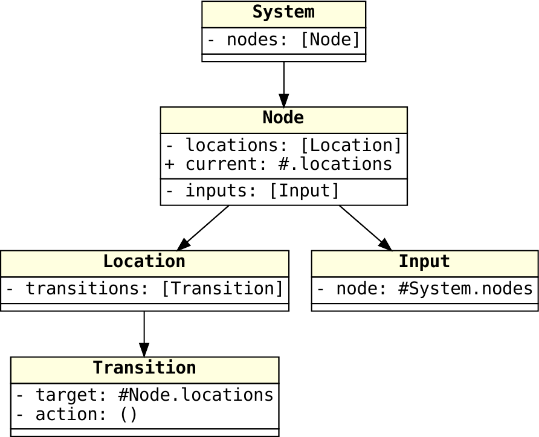
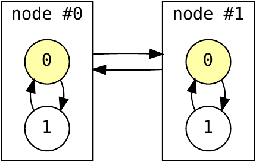

# Hybrid and Extensible Networks of Automata

`hyena` is a Python library to define and simulate (ie, execute) hybrid and extensible networks of automata (HyENA).
A HyENA consists of a collection of finite automata that execute on a network while sharing some data.
HyENAs are:

 * extensible in a least two ways:
   - adding data to the execution context
   - sub-classing the basic structures forming the basic HyENA model
 * hybrid in that a state is defined by:
   - the states of the automata
   - arbitrary additional data (possible updated by the system or its environment)

This document starts by presenting the concepts underlying `hyena` and then progressively moves to the concrete usage of the library and the associated command-line tools.

## Basic HyENA model

This basic model features 5 classes that can be seen as structures with predefined fields:

 * `System`: stores a full HyENA
 * `Node`: stores one automaton of a `System` instance
 * `Location`: stores one location (ie, state) of an automaton, we use the term _location_ in order to make a clear distinction with one state of the system
 * `Transition`: stores one transition between two locations
 * `Input`: stores an explicit link between two nodes (to form an explicit network)

 Although the network may be left implicit and `Input` is not strictly necessary, we prefer to have it in the basic model to emphasis the network dimension of HyENAs.

 These classes and their relations are illustrated here:



For each class, its fields are listed either starting with a `-`, which means that the field is immutable, or starting with a `+`, which means that the filed may be updated during execution.
In this minimalistic model, only `Node.current` is mutable.
Each field also has a type, noted as follows:

 * atomic types are `bool`, `int`, and the classes defined above
 * `[T]` is a fixed-length array of instances of class `T` (eg, `System.nodes` is an array of `Node` instances); arrays are implemented as a `tuple` if immutable, or as a custom `array` class if mutable 
 * `#.F` is an index of field `.F` is the current class (eg, `Node.current` is an index of `Node.locations`)
 * `#T.F` is an index of field `.F` in class `T` (eg, `Input.node` is an index of `System.nodes`)
 * `(T)` is an expression that can be evaluated to a value of type `T` (eg, `Transition.guard` is a Boolean expression)
 * `()` is a statement, that is, a sequence of assignments `V = E` where `V` is a path to a mutable field and `E` is an expression

Note that these types are currently loosely enforced in simulation, for instance, it is possible to set `Node.current` to a negative value, but this will lead to errors in the simulation.
So, even if it will be improved in future versions, currently it is mainly modeler's responsibility to respect the typing constraints.

The fields of each class are presented in two sections: the upper section lists the _primitive_ fields that are mandatory in every instance; the lower section lists the fields that can be omitted without impairing the capability to execute a system.
In other words: if a primitive field is missing, execution will fail; if a non-primitive field is missing, execution may succeed as long as the field is not used by this particular system.
This differs from optional fields (see below) that every system should consider as potentially missing.
In the basic model above, all the fields are primitive ones except for `Node.inputs`.

From the fields depicted above, we can describe more precisely each class of the basic model:

 * a `System` instance consists of an array of `Node` instances
 * a `Node` instance consists of:
   - an array of `Input` instances
   - an array of `Locations` instances
   - the index of the current location in this latter array
 * an `Input` consists of the number of a node that connects to this input (ie, if in `system` there is a link from node `a` to node `b`, then there is in `b.inputs` one `Input` value whose field `.node` is the index of `a` in `system.nodes`)
 * a `Location` consists of an array of `Transition` instances
 * a `Transition` consists of:
   - a `.target` location given as an index in the current node's `.locations` field
   - a `.guard` that is a Boolean expression
   - a `.cost` that is an `int`-valued expression
   - an `.update` that is a statement

## Execution semantics

Let `system` be an instance of the `System` class as defined above.
Such a system is aimed at being executed, or simulated, that is: its transitions may be fired, depending on their guards, at a given cost, and leading to updates in the structures.
To describe such an executable semantics, `hyena` adopts the Python language as a concrete way to write and execute expressions and statements such as guards, costs, or updates.
The execution semantics defines how transitions can be executed by making explicit in which context each expression or statement is evaluated (following the usual rules of Python).
We assume a subset of Python that allows no side-effects other than assignments in `Transition.update`, eg, a function is not allowed to assign a global variable.
As for the type constraints, this is only loosely enforced and it its modeler's responsibility to avoid side-effects.

### System states

The state of a `System` instance is defined as the values that are stored within every mutable field of the system's objects.
This may be encoded as a Python `dict` representing the nesting of the structures.
For instance, assuming a system with 3 nodes, each with 2 locations, its state could be:

```python
{ # the state of system is the state of its nodes
    "nodes": [
        { # the state of node #0 is the value of its field .current
          # no other field of a Node has a state
            "current": 0
        },
        { # state of node #1
            "current": 0
        },
        { # state of node #2
            "current": 0
        }
    ]
}
```

This means that every node is in its first location.
Executing a transition in node `#2` that lead to location `#1` in this node may yield state:

```python
{"nodes": [{"current": 0}, {"current": 0}, {"current": 1}]}
```

In the implementation, such a state is implemented as a hashable frozen `dict` and is displayed in a more explicit way as:

```python
system[nodes=(node[current=0], node[current=0], node[current=1])]
```

The initial state of a system is its state when no transition has been executed yet, ie, this is the state that follows for the system's definition.

### Execution contexts

Every expression or statement is defined as the field of a class instance, itself stored within another class instance, and so on until we reach `System` instance.
In our minimal HyENA model, consider a very simple system with:

 * two nodes
 * each node is the input of the other one
 * each node has two locations 
 * each location has a transition to the other one
 * transitions have no guard (ie, expression `True`) and perform no update (ie, empty statement of `pass`)
 * each transition has a cost that evaluates to `0` if the other node is in the same location as the one that executes the transition, or to `1` otherwise

This system could be schematically drawn as follows:



where each node is depicted as a rectangle within which its automaton is drawn, the current location of each one being `0`, highlighted in light yellow.

We focus on `Location.cost` expressions since they are the only expressions to require a real evaluation.
Considering that our `System` instance is `system`, we have four cost expressions:

 * `system.nodes[0].locations[0].transitions[0].cost`
 * `system.nodes[0].locations[1].transitions[0].cost`
 * `system.nodes[1].locations[0].transitions[0].cost`
 * `system.nodes[1].locations[1].transitions[0].cost`

Each of this expression can be evaluated in a context that corresponds exactly to the "path" (ie, the nesting of structures) that allows to access it from `system`.
This is equivalent to defining four functions, one for each expression, as follows:

```python
system = ...  # the System instance

def make_cost(node, location, transition):
    # additional declarations may come here as explained later on 
    def cost():
        return ... # see below
    transition.cost = cost

make_cost(system.nodes[0],
          system.nodes[0].locations[0],
          system.nodes[0].locations[0].transitions[0])
make_cost(system.nodes[0],
          system.nodes[0].locations[1],
          system.nodes[0].locations[1].transitions[0])
make_cost(system.nodes[1],
          system.nodes[1].locations[0],
          system.nodes[1].locations[0].transitions[0])
make_cost(system.nodes[1],
          system.nodes[1].locations[1],
          system.nodes[1].locations[1].transitions[0])
```

In this code, the function `cost` for each transition is defined within a closure that corresponds to its context, then it is assigned to the transition.
Doing so, we can have the same expression instead of `...` returned by all the functions:

```python
0 if node.current == system.nodes[node.inputs[0].node].current else 1
```

To summarise, HyENAs' expressions and assignments are defined in the scope of the objects that contain them: a node is in the scope of the system, a location is in the scope of its node, a transition is in the scope of its location, and a guard, a cost, and an update are in the scope of their transition.
These scopes are defined by the inclusion of one object into another, just like a Python scope, or closure, is defined by the inclusion of one function into another.

### Transitions execution

Executing transitions allows to build traces that are sequences of alternating states and transitions (with costs): starting from the initial state, a transition `t` may be executed if its guard `t.guard` evaluates to `True` in the current execution context, its cost `t.cost` is evaluated in the same context, and it updates current state by performing all the assignments in `t.update` as well as `node.current = t.target` to move to the expected location.
This yields a new state that extends the trace.

It is also possible to build a state graph that aggregates all the traces.
It is the smallest graph such that the initial state is a vertex and:

 * if `p` is a vertex and,
 * a transition `t` allows to reach a state `s` from `p` at cost `c`

then `s` is also a vertex and there is an edge from `p` to `s` labelled by `(t,c)`.

## Using `hyena`

`hyena` consists of a library to model, extend, and simulate HyENAs, complemented with a command line tools to draw models.

### Concrete syntax for models

Systems can be built fully in Python by instantiating classes, but usually it is more convenient to load them from files.
A system in `hyena` consists of three components:

 * a model that defines the classes to be used, eg, the basic model presented so far is defined in module `hyena.ena` (not shown here)
 * a Python file that defines defaults to instantiate these classes
 * a JSON file that defines the instances and may override these defaults 

The Python file `examples/simple.py` to build our simple example above is as follows:

```python
from hyena import Template

class Transition(Template):
    def guard(self):
        return True
    def cost(self):
        idx = node.inputs[0].node
        if node.current == system.nodes[idx].current:
            return 0
        else:
            return 1
    def update(self):
        pass
```

First it imports base class `Template` from `hyena`.
Then it defines a template for class `Transition` by sublassing `Template` and setting defaults for its fields `.guard`, `.cost` and `.update`.
This means that every `Transition` instance to be created will be initialised this way unless otherwise specified.
Here, we implemented expressions and statements as methods of class `Transition`.
Since these methods are defined in the scope of `Transition`, they have access to global objects `node` and `system` (as well as `transition` and `location` that are not used here) that will be provided at run time.
But currently these objects objects are undefined.
Thus, when using a Python type checker or linter while writing the template above, it may complain that `node` and `system` are not defined.
This can be fixed by adding two lines at the beginning of the template:

```python
from hyena import Dummy
system = node = Dummy()
```

The two objects are now declared and class `Dummy` makes reasonable efforts to satisfy type checkers.
In general, every name that is expected to exist at runtime and is used inside a `Template` method can be declared this way.

Moreover, every name that is visible within the template file will be visible from the functions defined here.
For instance, if we add a global declaration `spam = 42` in `examples/simple.py` then method `Transition.cost` could refer to it.

The template above could as well be defined using strings instead of functions, in which case `.cost` and `.guard` should be expressions, and `.update` a `;`-separated list of assignments:

```python
from hyena import Template

class Transition(Template):
    guard = "True"
    cost = "0 if node.current == system.nodes[node.inputs[0].node].current else 1"
    update = ""
```

Then, the JSON file `examples/simple.json` defines the full system as a nest of objects or arrays corresponding to the nesting of Python objects or arrays. 
In the code below, we add Python comments to the JSON source in order to make it clearer, but remember that JSON does not accept comments:

```python
{ # fields for system, that is: just .nodes
  "nodes": [ # system.nodes
    { # system.nodes[0]
      "inputs": [ # system.nodes[0].inputs
        { # system.nodes[0].inputs[0]
          "node": 1
        }
      ],
      "locations": [ # system.nodes[0].locations
        { # system.nodes[0].locations[0]
          "transitions": [ # system.nodes[0].locations[0].transitions
            { # system.nodes[0].locations[0].transitions[0]
              # only field .target is provided
              "target": 1
              # the rest will come for Python template
            }
          ]
        },
        { # system.nodes[0].locations[1]
          "transitions": [{"target": 0}]
        }
      ],
      "current": 0  # this could have been defined in Python template
    },
    { # system.nodes[1]
      "inputs": [{"node": 0}],
      "locations": [{"transitions": [{"target": 1}]},
                    {"transitions": [{"target": 0}]}],
      "current": 0
    }
  ]
}
```

A system is loaded from its three components:

 * first the classes are loaded from a Python module, like `hyena.ena`
 * then a JSON file is loaded to provide the content of the instances to be constructed, normally starting from `System`
 * if some field is not given in this JSON file, it is taken from the Python template
 * if the field is not given either in the Python template, this result in an error if the field is primitive, or a warning otherwise
 * if other fields are provided in the JSON file or in the Python template, they are included in the generated objects and considered as constant fields (and as before, if a field is defined at both places, its value from the JSON file is preferred)

### Drawing models

`hyena` allows to draw a model or a fully instantiated system.
To do so, module `hena.draw` provides a command-line interface.
For instance:

```shell
sh> python -m hyena.draw hyena.ena.System
```
The above command asks `hyena.draw` to load class `System` in `heyna.ena` and to draw it as a graph representing its fields and the classes they may contain.
This is how we obtained the first picture at the beginning of this README.
Option `-o PATH` allows to save the picture to a specific path, otherwise a default path is constructed (here `hyena_ena_System.pdf`)

```shell
sh> python -m hyena.draw hyena.ena.System examples/simple.py examples/simple.json
```

The above command asks `hyena.draw` to load a full system as defined in class `hyena.ena.System`, using the templates in `examples/simple.py` and the objects content defined in `examples/simple.json`.
Here again, option `-o` allows to choose output file.
Additionally, option `-g` allows to pass [GraphViz](https://www.graphviz.org) options to be inserted at graph level, and option `-c` allows to pass GraphViz options to be inserted at cluster level (ie, withing each node that contains an automaton).
Finally, option `-a` orders `hyena.draw` to draw the automata inside each node, instead of juste their current location.
For instance, the second picture above was generated using:

```shell
sh> python -m hyena.draw -a -g "newrank=true; rankdir=LR" -c "rank=same" hyena.ena.System examples/simple.py examples/simple.json
```

### Simulation

`hyena` allows to simulate a system in several ways:

 * directly from Python using an instance of class `System`
 * through an interactive simulator that provides a basic user interface
 * by computing the reachable states and possibly checking them

#### Direct simulation from Python

From Python, one can load the module that defines the classes and then load a system for its Python and JSON files:

```ipython
In [1]: from hyena.ena import System

In [2]: system = System.from_json("examples/simple.json", "examples/simple.py")
```

This system object has exactly the expected fields and nested structures as described in the class graph (plus the extra fields that may have been provided in the JSON file or the Python template).
It also has a property `state` that returns the current state, and a method `succ()` that computes the successor states.

```ipython
In [3]: system.state
Out[3]: system[nodes=(node[current=0], node[current=0])]

In [4]: succ = list(system.succ())

In [5]: succ
Out[5]: 
[(system[nodes=(node[current=1], node[current=0])],
  ('nodes', 0, 'locations', 0, 'transitions', 0),
  0),
 (system[nodes=(node[current=0], node[current=1])],
  ('nodes', 1, 'locations', 0, 'transitions', 0),
  0)]
```

Note that `system.succ()` returns a generator (thus the use of `list` to capture its items) of triples `(s, p, c)` where:

 * each `s` is a successor state
 * each `p` is the path to the transition that was executed to reach `s` (one can use `system[p]` to retrieved the corresponding `Transition` instance)
 * each `c` is the cost of executing this transition

`system.state` can also be assigned to move to another state from which others successor states can be computed:

```ipython
In [6]: s, p, c = succ[0]

In [7]: system.state = s

In [8]: list(system.succ())
Out[8]: 
[(system[nodes=(node[current=0], node[current=0])],
  ('nodes', 0, 'locations', 1, 'transitions', 0),
  1),
 (system[nodes=(node[current=1], node[current=1])],
  ('nodes', 1, 'locations', 0, 'transitions', 0),
  1)]
```

It is also possible to pass directly a state to `system.succ()`:

```ipython
In [9]: s, p, c = succ[1]

In [10]: list(system.succ(s))
Out[10]: 
[(system[nodes=(node[current=0], node[current=0])],
  ('nodes', 0, 'locations', 1, 'transitions', 0),
  1),
 (system[nodes=(node[current=1], node[current=1])],
  ('nodes', 1, 'locations', 0, 'transitions', 0),
  1)]
```

#### Interactive simulation

Interactive simulation can be started with, eg:

```shell
sh> python -m hyena.simul -j examples/simple.json -p examples/simple.py
```

This yields a shell that prompts for commands to explore a trace.
Option `-c` allows to load the system from a class other that `hyena.ena.System`.
Within the simulator, command `help` prints help about the available commands, and `help cmd` prints more details about a specific command.
States are displayed as trees rooted at `system`, and successor states are displayed as just what will change in the state.

#### Reachability analysis

Some models may reach finitely many states, for instance our simple model, because it has no variables other that the current location of its automata.
In such a case, `hyena` allows to compute all these reachable states and to check assertions on them.
However, if the set of reachable states is not finite, this computation will run until it crashes saturating the memory.
In such situations, an option is available to bound exploration to a finite number of states.

Reachability analyser can be started with, eg:

```shell
sh> python -m hyena.reach -j examples/simple.json -p examples/simple.py
```

Invoked this way, it will just explore the state-space until all reachable states are computed.
Like for `hyena.simul`, option `-c` allows to load the system from a class other that `hyena.ena.System`.
Other options allow to control exploration:

 * `-v` toggles printing each explored state
 * `-l NUM` limits the state-space exploration to `NUM` states
 * `-s PATH` saves the state-space to a JSON file after its exploration
 * `-a EXPR` adds an assertion to be checked on every state, see below
 * `-t` when an assertion is violated, prints a trace to it from initial state

Option `-a` adds a property to be checked on every state just before its successors are computed.
Using `-a` several times allow to check several properties.
For instance, one could run:

```shell
sh> python -m hyena.reach -j examples/simple.json -p examples/simple.py -t -a 'system.nodes[0].current == 0'
... 3 states + 2 to explore
### trace ###
#0:
 ├─ nodes[0]
 │  └─ current: 0
 └─ nodes[1]
    └─ current: 0
>>> system.nodes[0].locations[0].transitions[0] (+$0 => $0)
#1:
 ├─ nodes[0]
 │  └─ current: 1
 └─ nodes[1]
    └─ current: 0
assert failed: system.nodes[0].current == 0
on state: system[nodes=(node[current=1], node[current=0])]
```

As shown above, assertions are Python Boolean expressions that check the values of some fields in a state.
Note that assertions are checked against the whole system, including the constant fields.
Note also that assertions may fail for two reasons: if they are not verified at a state, or if they raised an exception, in which case the error will be printed as well.

## Extending HyENAs

### Adding extra fields

The simplest method to extend a HyENA model is to add fields to it, either through a Python template or through the JSON file.
Consider for instance our previous example and assume that we want to simplify the expression of the guards by using an auxiliary function `sameloc()` to tell whether the two nodes are in the same current location.
This requires a function `sameloc()` to be visible in the scope of the guards.
We can achieve this by redefining the Python template and adding `sameloc` as a new method in `Transition` as follows (see also `examples/simple-bis.py`):

```python
from hyena import Template

class Transition(Template):
    guard = "True"
    update = ""
    def cost(self):
        if self.sameloc():
            return 0
        else:
            return 1
    def sameloc(self):
        idx = node.inputs[0].node
        return node.current == system.nodes[idx].current
```

Note that such auxiliary functions may have additional parameters just like any method.
At any point of the objects hierarchy, we could include new names, storing values or functions, that will be made available as constant fields of the class where they have been defined.

### Extending classes

The extension presented above does not change the HyENA classes, and it introduces only constants and intermediate methods that help writing a HyENA in a simpler way.
However, it is also possible to extend existing classes (or even to create completely new ones).
For instance, consider we want to add a counter to nodes in order to record how many transitions each node fired.
Then, we would like that the cost of a transition is either `0` as before, or is the value of this counter.
This can be achieved as in `examples/counter.py`:

```python
from hyena import Field, ena
from hyena.ena import *

@dataclass
class Node(ena.Node):
    count: Field[int]

@dataclass
class System(ena.System):
    pass
```

In this module, we import from `hyena`:

 * type hint `Field` that allows to define fields in a HyENA class
 * sub-module `ena` that we want to extend

Then we import everything from `hyena.ena` in order to make visible its classes.
Next, we extend class `Node` by adding a field `count` that is an `int` (doing so, we hide the previous value of `Node` that was imported from `hyena.ena`).
Finally, we extend class `System` but we add noting to it.
This step is required because later we will load systems from `examples.counter.System` and doing so, the library will query its module.
If we don't redefine `System`, the library would retrieve the value imported from `hyena.ena` which is not the extended version we want to use.
By redefining `System` this way, we ensure that the library is aware that the right module to work with is `examples.counter`.

To instantiate this model, we can reuse `examples/simple.json` as its JSON file, and use `examples/counter-tpl.py` as its Python template:

```python
from hyena import Template

class Transition(Template):
    guard = "True"
    def cost(self):
        if self.sameloc():
            return 0
        else:
            return node.count
    def sameloc(self):
        idx = node.inputs[0].node
        return node.current == system.nodes[idx].current
    def update(self):
        node.count += 1

class Node(Template):
    current = 0
    count = 0
```

This template defines the default values for:

 * `Transition.cost`, adapted from the one we had previously
 * `Transition.update` to count every transition firing
 * `Node.current` (which will be overridden from JSON because so does `examples/simple.json`)
 * `Node.count` that is zero initially

In general, `Transition.update` is expected to be a sequence of assignments whose targets are all mutable fields of an object in the system.
This sequence can be encoded in a string by separating assignments with `;`, or it can be expressed as a function as above.
Upon firing, the sequence is automatically completed with `node.current = transition.target`.

#### `Struct` and `Field`

Every class defined in an extension module like above should be either a subclass of one from basic HyENAs, or a subclass of `hyena.Struct` (that itself is the parent class of HyENAs classes).
`hyena` also provides `hyena.StrEnum` that is supported (in particular, it is drawn in class diagrams).
Any other class or object defined in an extension module may not work as expected as `hyena` will not consider it when constructing the scopes of methods.
On the other hand, anything declared within a Python template will be visible at run time.

The fields of a `Struct` subclass should be all declared without a default value (this is templates' job do do this) and with a type hint that `hyena` understands:

 * `Field[base]` is a field of type `base` (where `base` is one of `bool`, `int`, a subclass of `Struct`, or an instance of `StrEnum`)
 * `Index[array]` is an `int`-valued field that ranges over the index of the given array (passed as a string), for instance `Node.current` has type hint `Index[".location"]`, and for `Input.node` it is `Index["Node.nodes"]`.
 * `Array[base]` is an array that contains instances of `base`
 * `Array[base, size]` is an array that contains instance of `base` and whose size is constrained by field `size` itself given as a string that is either:
   - the name of an `int`-valued field (eg, `".name"` to refer to a field in the current class, or `"Class.name"` to refer to a field in another class)
   - or as the index in another array (eg, `#.name` or `#Class.name`) which means that both arrays have the same size
 * `Expr[base]` is an expression that evaluates to `base` (`int` or `bool`) and may be concretely implemented as a method or a string as for `Transition.guard` or `Transition.cost`
 * `Stmt` is a statement, ie, a sequence of assignments that may be concretely implemented as a method or a string as for `Transition.update`
 * `Const[hint]` is a non-mutable field, if `Const` is not used then the field is mutable
 * `Option[hint]` is an optional field, if it is not provided as JSON or Python template, then its value is set to `None` without any warning
 * `Unique[hint, scope]` is a field whose value is expected to be unique in the given `scope`, the latter being the name of a `Struct` subclass; for instance, defining a field `Node.name: Unique[str, "System"]` states that every `Node` instance should have a value in its field `.name` that is distinct from that in every other nodes; defining a field `Location.name: Unique[str, "Node"]` is similar but distinct nodes may have locations with the same `.name` as the scope is here limited to `Node`
 * `Macro[base, expr]` defines a constant field whose value has type `base` and will be computed from `expr` when the `System` is instantiated (ie, at the initial state), for instance, considering we have added `Node.name` as above, we could add `Input.name: Macro[str, "system.nodes[input.node].name"]` thus the name of an input is the name of the node it corresponds to

Not all these typing constraints are currently enforced at runtime, but future version of `hyena` will progressively do it.
Not also that, from a Python perspective, these type hints are currently not recognised by type checkers and so they may raise concerns with respect to the usage of fields.

## Installation

Within the project directory cloned from the [`git` repository](https://github.com/fpom/hyena/), run:

```shell
sh> pip install .
```

This will install `hyena` and its dependencies:

 * [`colorama`](https://github.com/tartley/colorama)
 * [`frozendict`](https://github.com/Marco-Sulla/python-frozendict)

## Licence

`hyena` is (C) 2023 Franck Pommereau <franck.pommereau@univ-evry.fr> and released under the terms of the MIT licence, see `LICENCE.md`.
